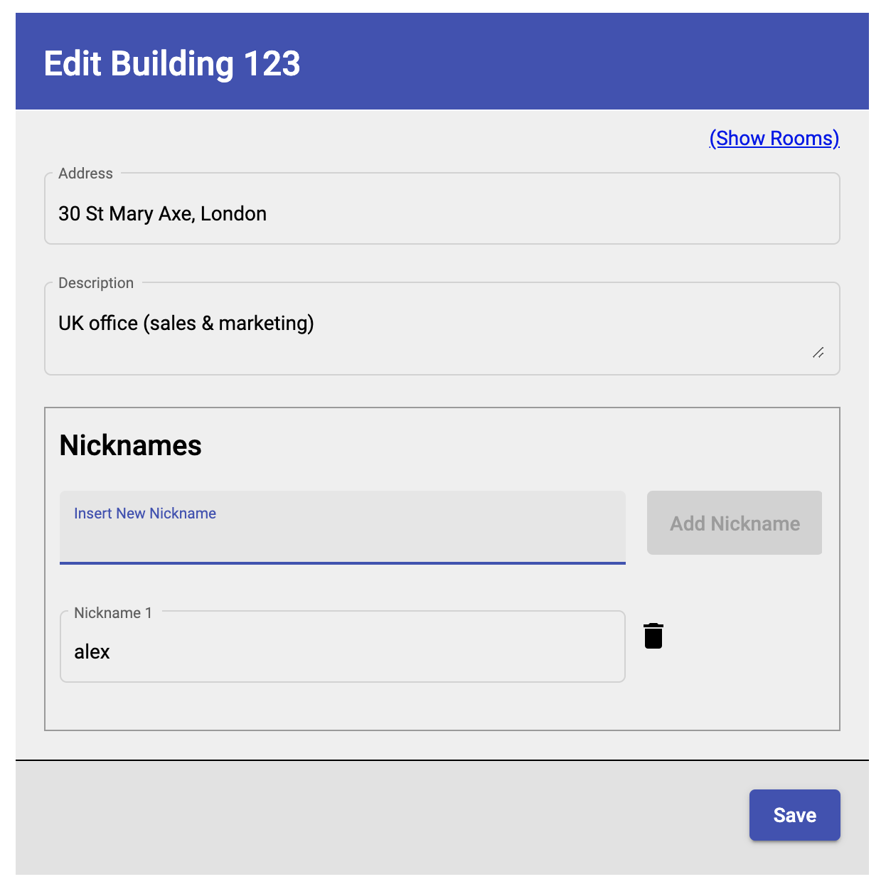
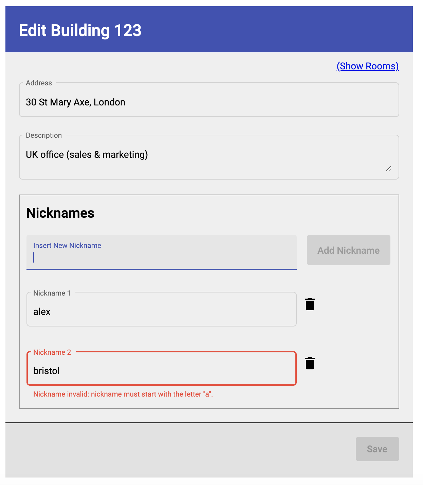
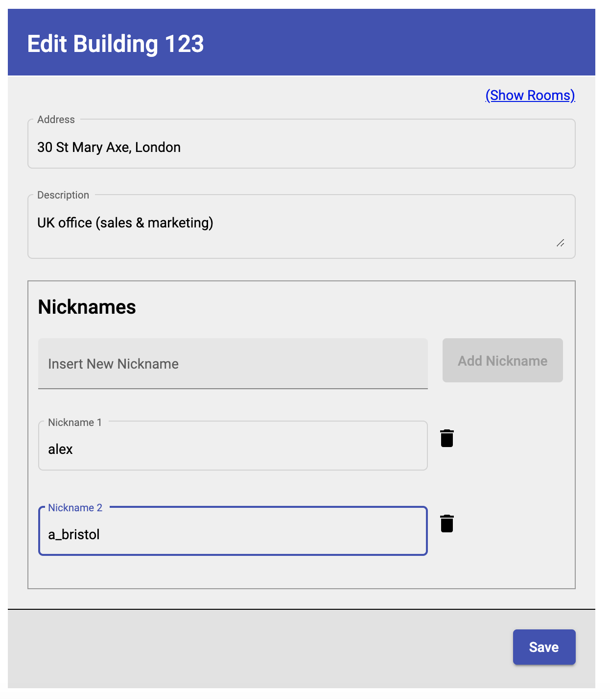
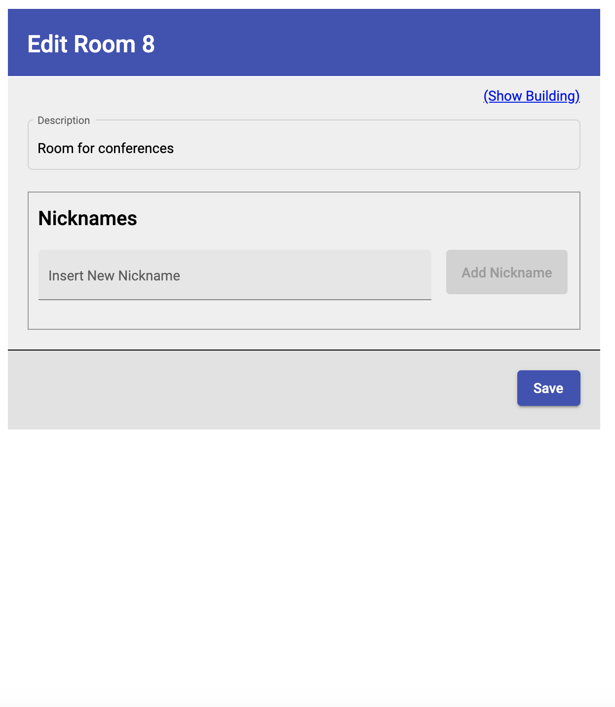
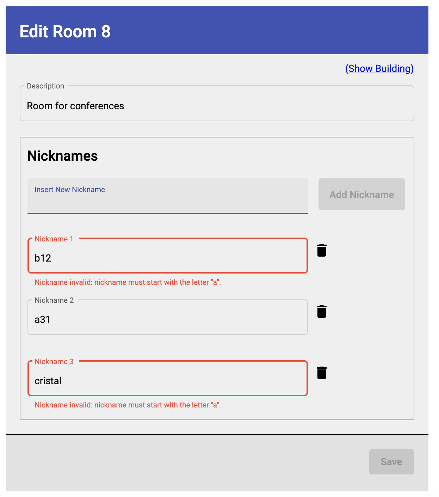
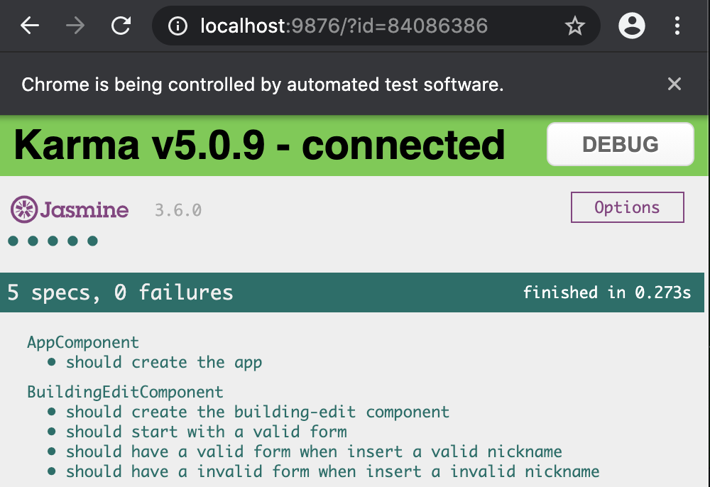

# Building Management System

This project is the Angular frontend app for a Building Management System. 

To see a demo of the app go to: https://building-management-system.stackblitz.io/

The demo stackblitz app is linked to this repo, and you can see the code next to the running app [here](https://stackblitz.com/edit/building-management-system?file=src/app/views/pages/buildings/building-edit/building-edit.component.ts).

There are 2 pages within the app:

1. The "Building Edit" page (path: `"src/app/views/pages/buildings/building-edit"`) that can be access from 2 different routes:
   
    From the demo stackblitz:

    - https://building-management-system.stackblitz.io/
    - https://building-management-system.stackblitz.io/building/123/edit

    From a local server:

    - http://localhost:4200/
    - http://localhost:4200/building/123/edit

2. The "Room Edit" page (path: "src/app/views/pages/buildings/building-edit") that can be access from the route:

    From the demo stackblitz:

    - https://building-management-system.stackblitz.io/building/123/room/19/edit

    From a local server:
   
    - http://localhost:4200/building/123/room/19/edit

These 2 pages showcase the requirement of the implementation of a reusable component "Nickname Editor" (path: "src/app/views/shared/nickname-editor") in different parent components. The "Building Edit" page uses the "Nickname Editor" as a child component to add nicknames of buildings, as well as the the "Room Edit" page uses the "Nickname Editor" as a child component to add nicknames of rooms.

The implementation of the "Nickname Editor", currently imitates a validation against asynchronous backend system call, after each nickname is inserted in the form. For simplicity, it is implemented as an Angular service which returns (as an Observable) true if name starts with letter 'a' and false otherwise (check the code here: `"src/app/core/services/nickname-validation.service.ts"`). When an invalid nickname is inserted, the whole form gets invalid and the "Save" button is disabled until no invalid nicknames exist. Some screenshots about this validation here:

---

Edit Building Page

---

Edit Room Page

---

## Installation

Run `npm install`

## How to Run

Run `ng serve` for a dev server and navigate to `http://localhost:4200/`

## Running unit tests

Run `ng test` to execute the unit tests via [Karma](https://karma-runner.github.io). Find most of the sample tests in the file `"src/app/views/pages/buildings/building-edit/building-edit.component.spec.ts"`

